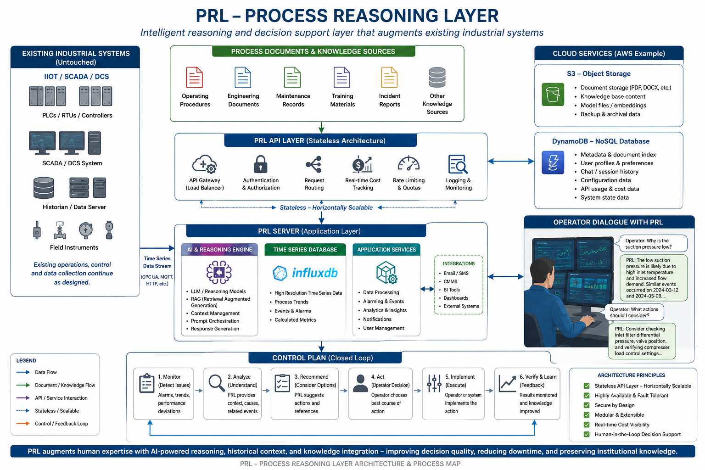

# PRL-AI

# Process Reasoning Layer

## An AI-Assisted Operational Reasoning Framework for Industrial Systems

  

---

## Introduction

The Process Reasoning Layer (PRL) is a concept, methodology, and technology framework for applying modern Artificial Intelligence to industrial and technical systems.

PRL is based upon a simple observation:

Modern industrial facilities generate enormous amounts of information, yet operators and engineers are often required to make decisions using fragmented documentation, alarm systems, historical records, maintenance information, and years of accumulated operational experience.

The challenge is no longer obtaining data.

The challenge is understanding it.

PRL seeks to address this challenge by providing an AI-assisted reasoning layer that operates alongside existing industrial systems.

---

## Vision

The Process Reasoning Layer is intended to augment existing industrial systems by combining:

* Time-series process data
* Engineering documentation
* Operating procedures
* Historical operating events
* Maintenance records
* Training materials
* Institutional knowledge
* Modern AI reasoning systems

into a unified decision-support framework.

The objective is to help operators, engineers, technicians, and managers make better-informed decisions within complex technical environments.

---

## Why PRL Exists

Industrial systems continue to become increasingly complex.

Organizations face challenges including:

* Increasing system complexity
* Workforce retirements
* Knowledge retention
* Alarm overload
* Growing documentation requirements
* Increasing operational risk
* Expanding volumes of process data

At the same time, modern AI technologies now provide capabilities that were not practical only a few years ago.

PRL represents one possible framework for applying these technologies in a practical and responsible manner.

Traditional systems tell personnel what is happening.

PRL helps explain:

* Why it is happening
* What it means
* What similar situations have occurred previously
* What documentation should be considered
* What actions may be appropriate

---

## Relationship to Existing Technologies

### An Augmentation Layer, Not a Replacement

PRL is not intended to replace:

* PLC systems
* DCS systems
* SCADA systems
* Historians
* Advanced Process Control systems
* Optimization systems
* Operators
* Engineers

Organizations have invested significant resources in these technologies and they will continue to provide substantial value.

PRL is designed to augment these existing investments and help organizations derive greater value from information they already possess.

---

### Building Upon Existing Investments

PRL is designed to work alongside:

* PLC systems
* DCS systems
* SCADA systems
* Historian platforms
* Industrial databases
* Maintenance management systems
* Alarm management systems
* Engineering document systems
* Industrial IoT platforms
* Advanced Process Control (APC) systems
* Optimization systems
* Analytics and reporting systems

Rather than replacing these systems, PRL seeks to connect information from multiple sources and provide additional context and reasoning capabilities.

---

### Relationship to Historical Technologies

PRL builds upon decades of prior work in:

* Process control
* Operations research
* Optimization systems
* Expert systems
* Industrial automation
* Artificial intelligence
* Industrial analytics

Examples include:

* PID control systems
* Advanced Process Control (APC)
* Expert systems
* Historian systems
* Sequential Empirical Optimization (SEO)
* Operations research methods
* Predictive analytics
* Industrial IoT platforms

Each generation of technology addressed a portion of the problem.

PRL represents a continuation of this evolution by combining:

* Operational data
* Historical information
* Engineering knowledge
* Documentation
* Human expertise
* Modern AI reasoning systems

into a unified decision-support framework.

---

### Human-Centered Design

PRL is intended to support people, not replace them.

Operators, engineers, technicians, and managers remain responsible for decisions affecting safety, operations, and business performance.

PRL serves as a reasoning and decision-support tool that can help personnel:

* Find information faster
* Understand operational situations more effectively
* Learn from historical events
* Evaluate possible courses of action

Human judgment remains central to the process.

---

## Core Concept

Expected Behavior → Defined by Engineering Knowledge and Control Plans

Actual Behavior → Observed Through Time-Series Data

PRL → Detects, Explains, and Provides Context

The objective is not simply alarm generation.

The objective is understanding.

---

## Example Architecture

**[PRL Architecture Diagram Placeholder]**

The architecture demonstrates how PRL can operate alongside existing industrial infrastructure while leveraging modern cloud services, document intelligence systems, time-series databases, and AI reasoning technologies.

---

## Potential Applications

Potential applications include:

* Manufacturing
* Utilities
* Electric power generation
* Natural gas systems
* Water and wastewater systems
* Compressor stations
* Metering systems
* Transportation systems
* Medical devices
* Building automation systems
* HVAC systems
* Refrigeration systems
* Renewable energy systems
* Environmental monitoring
* Research and development facilities
* Military and defense applications

Any process that generates time-dependent operational data may be a candidate for PRL technology.

---

## Competitive Advantages

### Working Platform Available Today

The individual technologies supporting PRL are commercially available and can be replicated by sufficiently motivated organizations.

However, the competitive advantage is not the existence of individual technologies but the fact that they have already been integrated into a working platform that can be demonstrated and deployed today.

### Rapid Development and Adaptation

A lean engineering organization can often evaluate, prototype, and deploy new capabilities significantly faster than large organizations requiring multiple departments and approval processes.

### Cross-Disciplinary Engineering Experience

PRL development combines:

* Mechanical engineering
* Product development
* Process controls
* Industrial operations
* Software development
* Cloud infrastructure
* Artificial intelligence
* Industrial IoT

This enables practical solutions grounded in operational reality.

### Existing Demonstrations and Deployment Experience

PRL benefits from existing demonstrations, cloud infrastructure, deployment procedures, and operational experience.

Organizations can evaluate working systems rather than beginning with conceptual discussions alone.

---

## Long-Term Vision

Just as SCADA systems, historians, dashboards, and Industrial IoT platforms became standard components of modern industrial systems, AI-assisted reasoning layers may become a common component of future industrial operations.

The objective of this project is to explore, develop, document, and demonstrate practical applications of Process Reasoning Layer technology.

---

## Current Status

The concepts described within this repository are under active development and evaluation.

Demonstration systems, reference architectures, implementation examples, deployment models, and supporting documentation will be added as the project evolves.

---

## Collaboration

Discussion, collaboration, and constructive feedback are welcome from:

* Engineers
* Operators
* Utilities
* Manufacturers
* Researchers
* Government organizations
* Software developers
* Industrial technology providers

interested in the future of industrial AI and operational reasoning systems.

---

## Contact

Robin Borland
Project Engineer

Integra Developments LLC

For consulting, pilot projects, training, collaboration opportunities, or technology discussions, please contact us.

