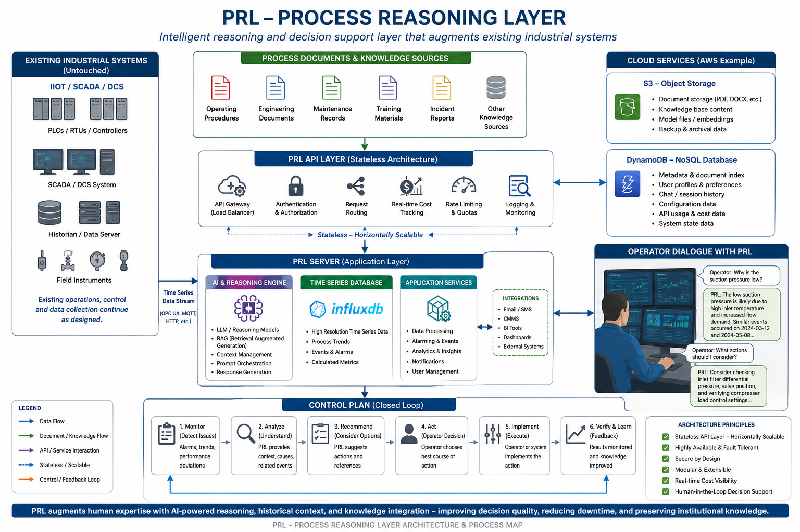

# PRL-AI

# Process Reasoning Layer (PRL)

## AI-Assisted Operational Reasoning for Industrial Systems

**Current reference implementation: PRL V2**

**Project website:** https://prl.pdf-insights.ai  
**Demonstration:** https://prl1.pdf-insights.ai

  

*Figure 1. Example Process Reasoning Layer (PRL) architecture showing how AI-assisted reasoning can operate alongside existing industrial systems without modifying existing control infrastructure.*

---

## What PRL Is

The Process Reasoning Layer (PRL) is a framework for combining live process information, engineering control plans, process documentation, operator context, and AI-assisted reasoning into an operational decision-support system.

Modern industrial facilities already generate large amounts of data. The difficult problem is often not obtaining more data, but understanding what the available data means in the context of engineering limits, recent process history, operating procedures, and accumulated process knowledge.

PRL is intended to help bridge that gap.

**Expected Behavior** → Defined by engineering knowledge and control plans  
**Actual Behavior** → Observed through time-series process data  
**PRL** → Detects, evaluates, explains, and provides context  
**Operator** → Reviews the information and decides what action, if any, should be taken

The objective is not simply alarm generation. The objective is understanding.

---

## PRL V2

PRL V2 moves the project from an initial reference concept toward a working operational reasoning platform.

The current implementation includes:

* Live and historical time-series process monitoring using InfluxDB
* Engineering control-plan limits, warning thresholds, priorities, expected patterns, and reaction plans
* Configurable telemetry lookback periods
* Deterministic status evaluation in Python
* Deterministic numeric comparisons before AI reasoning
* Scheduled automatic process reasoning
* Manual on-demand process interpretation
* Persistent operator-adjustable system settings
* Persistent latest reasoning results
* Operator notes and process context
* Process-document grounding through an external document-reasoning API
* Instant operator chat using current process evidence, recent process history, control-plan information, and process documentation
* Operator-chat save and clear functions
* 24-hour process trends and summaries
* A Control Plan Builder supporting steady-state and transformation processes, targets, rates, stages, overrides, reaction plans, document references, and PDF terminology cross-references

### Deterministic Engineering Comparisons

An important V2 design change is the separation of deterministic engineering calculations from AI explanation.

PRL code evaluates process values against warning thresholds and control limits before the information is sent to the AI reasoning layer. The AI is then instructed to treat those calculated comparisons as authoritative rather than independently deciding whether one numerical value is above or below another.

This allows conventional software logic to perform the numerical comparisons while the AI concentrates on explanation, context, documentation, and operator-oriented reasoning.

---

## Operator in the Middle

PRL is designed around an **operator-in-the-middle architecture**.

The official PRL reference implementation observes process information, evaluates that information against engineering control-plan expectations, and provides explanations and decision support. It does **not** directly issue commands to PLC, DCS, SCADA, or other industrial control systems, and it does not automatically actuate process equipment.

Operators and engineers remain responsible for determining and implementing operational actions.

This architectural separation is intentional. PRL is intended to support people, not replace the people or engineered systems responsible for operating and protecting an industrial process.

PRL should not be considered a replacement for PLC/DCS/SCADA logic, alarms, interlocks, safety systems, operating procedures, engineering review, or qualified operating personnel.

Forks or modified implementations may change this behavior. The operator-in-the-middle description applies to the official PRL reference architecture and implementation maintained in this repository.

---

## Security, Guardrails, and Responsible Industrial AI

There are legitimate concerns about guardrails, restrictions, security, and appropriate human oversight as AI systems become more capable. PRL welcomes the continuing development of responsible-use standards, AI guardrails, and security controls.

For the PRL reference implementation, the architecture itself provides an important guardrail: **PRL advises; the operator decides and acts.**

The reasoning layer is grounded using defined process evidence including:

* monitored process variables
* engineering control-plan limits and reaction plans
* recent process history
* operator-provided context
* process documentation

PRL V2 further reduces reliance on unconstrained model reasoning by performing warning and control-limit comparisons deterministically in Python before the AI receives the evidence.

The objective is not autonomous industrial control. The objective is to give operators and engineers better information with which to make decisions.

---

## Transparency and Public Source Distribution

Transparency is an important part of the PRL development approach.

The PRL application and reference implementation are published in this repository so engineers, operators, researchers, developers, and prospective users can inspect how the system is structured, evaluate the approach, test it, and understand the boundaries of the reference architecture rather than relying only on claims made by a proprietary application.

PRL is not presented as a completely open AI stack. The current implementation can depend on external API services and AI models whose internal model implementations may be proprietary. Those dependencies should be distinguished from the publicly inspectable PRL application code and reference architecture contained in this repository.

**Licensing note:** Publicly visible source code is not, by itself, an open-source software license. No broader license grant should be inferred unless a LICENSE file is added to this repository.

---

## Relationship to Existing Industrial Systems

PRL is an augmentation layer, not a replacement for existing industrial technology.

It is designed to work alongside systems such as:

* PLC systems
* DCS systems
* SCADA systems
* Historians and time-series databases
* Industrial IoT platforms
* Maintenance and alarm-management systems
* Engineering document systems
* Advanced Process Control systems
* Optimization and analytics systems

Organizations have already invested substantial resources in these technologies. PRL seeks to help personnel derive additional value from the information those systems already produce.

---

## Human-Centered Design

Operators, engineers, technicians, and managers remain responsible for decisions affecting safety, operations, maintenance, and business performance.

PRL can help personnel:

* identify process conditions requiring attention
* distinguish current conditions from recent excursions
* review process history
* find relevant engineering information faster
* understand operational situations in context
* evaluate practical operator checks
* preserve and make better use of process knowledge

Human judgment remains central to the process.

---

## Reference Architecture

A typical PRL deployment may combine:

1. **Process data** — existing historian data, industrial databases, or IoT telemetry.
2. **Control plan** — engineering limits, warnings, expected behavior, priorities, reaction plans, and document references.
3. **Process documentation** — manuals, procedures, specifications, standards, training material, and other technical knowledge.
4. **PRL deterministic evaluation** — conventional software evaluates numerical thresholds and process status.
5. **AI reasoning layer** — explains the evaluated evidence using process context and documentation.
6. **Operator interface** — dashboard, scheduled explanations, trends, and interactive operator questions.

PRL can therefore be introduced alongside existing infrastructure without requiring replacement of the plant control system.

---

## Repository Components

The V2 reference implementation includes:

* `app/prl_dashboard.py` — Streamlit monitoring console, process interpretation, trends, settings, and operator chat
* `app/prl_auto_runner.py` — scheduled reasoning engine and deterministic engineering comparisons
* `app/prl_control_plan_builder.py` — configurable control-plan CSV builder
* `app/prl_settings.py` — persistent settings management
* `run_prl_auto.sh` — scheduled-run wrapper using protected environment credentials
* `examples/` — example process material and configurations
* `docs/` — supporting project documentation

Protected API credentials and installation-specific identifiers are intentionally kept outside the repository and supplied through environment configuration.

---

## Potential Applications

PRL is intended as a general industrial reasoning framework. Potential applications include manufacturing, utilities, power generation, natural-gas systems, water and wastewater, compressor stations, transportation, building systems, HVAC and refrigeration, renewable energy, environmental monitoring, research facilities, test systems, and other processes that generate time-dependent operational data.

The architecture can be adapted to steady-state processes, transformation or batch processes, and dynamic systems.

---

## Current Status

PRL V2 is an actively developed reference implementation and demonstration platform. It is intended to support evaluation, research, pilot projects, and continued development of practical industrial AI reasoning systems.

The project will continue to evolve as additional applications, deployment experience, security practices, and industrial AI standards develop.

---

## Project Website and Demonstration

For the commercial project overview, applications, and contact information, visit:

https://prl.pdf-insights.ai

A working PRL demonstration is available at:

https://prl1.pdf-insights.ai

This GitHub repository remains the technical and transparency home for the PRL reference implementation.

---

## Collaboration

Discussion, collaboration, and constructive feedback are welcome from engineers, operators, manufacturers, utilities, researchers, universities, software developers, industrial technology providers, and organizations interested in practical and responsible industrial AI.

---

## Contact

Robin Borland  
Project Engineer  
Integra Developments LLC

For consulting, pilot projects, training, collaboration opportunities, or technology discussions, please visit the PRL project website.
